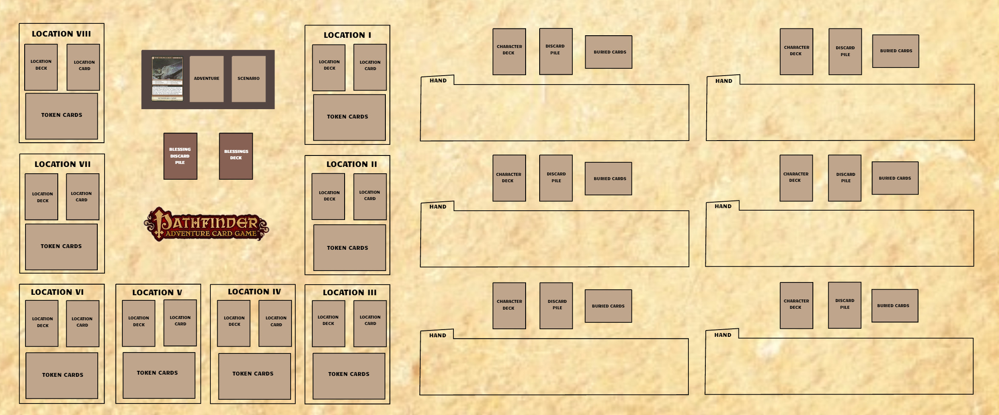

# PFACG-Roll20

**freeze.js:** Any token with "freeze" (case insensitive) in its name will be stuck in place. This is used for things like the representations of the blessings deck, so they don't get moved all over the board. This also lets all players select graphics, so they can be zoomed in with Z.

**locations.js:** Stores position data to placing tokens to represent cards on the table.

**main.js:** Handles *most* of the API commands used by the system.

**management.js:** Manages the game itself (start/reset)

**static-data.js:** Stores card data for all cards from Rise of the Runelords base set & most expansions (all APs, character deck expansion, and promo cards; individual character deck card/deck data not included because I don't own them). Image srcs should be good so long as I don't delete them, which I have no intention of doing, but if you *really* want to, you can re-upload all of the card images and get their URLs.

**utility.js:** Utility functions used by the rest of the system. They're all string-manipulation functions, and so they're prototyped onto `String` (except `guid`, which is static).

The game setup should automatically put card images and card backs in appropriate positions on the map, but I don't think it sets up any paths, text, or the background image. The `locations.js` values are assuming a 56x24 square map. This is how the board ought to look before the scripts start doing stuff:

